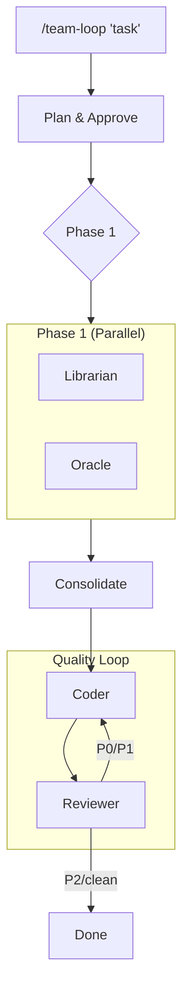

# Team-Loop Orchestration

Combines `/team`'s role-based parallel dispatch with `/graph-loop`'s iterative refinement. **Best of both worlds**: specialized agents that iterate until quality gates pass.

## Quick Start

```
/team-loop "Build a user authentication system with JWT"
```

This will:
1. **Research** (Librarian) + **Design** (Oracle) in parallel
2. **Implement** (Coder) based on Oracle's architecture
3. **Review** (Reviewer) with P0/P1/P2/clean output
4. **Loop** Coder↔Reviewer until P2 or clean (max 3 iterations)

## When to Use

| Scenario | Skill |
|----------|-------|
| Single-shot parallel dispatch | `/team` |
| Custom YAML workflow graphs | `/graph-loop` |
| **Role-based agents + iteration** | **`/team-loop`** |
| Simple autonomous loops | Ralph (`/ralph-loop`) |

## Workflow



## Execution Flow

### Phase 1: Research + Design (Parallel)

```yaml
# Dispatched in SINGLE message for parallel execution
Task #1 (Librarian):
  subagent_type: "gemini"  # or "Explore" fallback
  run_in_background: true
  prompt: |
    ROLE: Librarian (Research)
    TASK: Research codebase for [topic]
    Find: patterns, conventions, relevant files
    Report: file paths, existing patterns, recommendations

Task #2 (Oracle):
  subagent_type: "general-purpose"
  model: "opus"
  run_in_background: true
  prompt: |
    ROLE: Oracle (Architect)
    TASK: Design [feature]
    Output: Architecture with file structure, models, integration points
```

### Phase 2: Implementation (Sequential)

```yaml
Task (Coder):
  subagent_type: "codex"
  prompt: |
    ROLE: Coder
    ARCHITECTURE: [Oracle's output]
    CONTEXT: [Librarian's findings]

    Implement production-ready code following the architecture.
```

### Phase 3: Review Loop

```yaml
# Loop until P2/clean or max iterations
Task (Reviewer):
  subagent_type: "codex"
  prompt: |
    ROLE: Reviewer
    FILES: [Coder's changed files]

    Review for: correctness, security, quality, tests.
    Output severity: P0/P1/P2/clean

    For P0/P1, list specific issues with file:line references.
```

**If Reviewer outputs P0 or P1:**

```yaml
Task (Coder - Fix):
  subagent_type: "codex"
  prompt: |
    ROLE: Coder (Fix Issues)
    REVIEW FINDINGS: [Reviewer's P0/P1 issues]

    Fix the issues listed. Maintain existing functionality.
```

Then back to Reviewer. Loop continues until P2/clean or max 3 iterations.

## Configuration

| Option | Default | Description |
|--------|---------|-------------|
| `--max-loops` | 3 | Max Coder↔Reviewer iterations |
| `--quality-bar` | P2 | Minimum quality to exit (P2 or clean) |
| `--skip-research` | false | Skip Librarian phase |
| `--skip-design` | false | Skip Oracle phase |

### Examples

```bash
# Full workflow with 5 max iterations
/team-loop "Add rate limiting" --max-loops 5

# Skip research, start from design
/team-loop "Refactor auth module" --skip-research

# Quick implementation, only require clean to exit
/team-loop "Fix login bug" --skip-research --skip-design --quality-bar clean
```

## Output Format

```markdown
## Team-Loop Results: [Task]

### Phase 1: Research & Design
| Agent | Status | Key Findings |
|-------|--------|--------------|
| Librarian | ✅ | Found 3 auth patterns, recommend OAuth2 |
| Oracle | ✅ | Designed JWT + refresh token architecture |

### Phase 2: Implementation
| Iteration | Coder | Reviewer | Issues |
|-----------|-------|----------|--------|
| 1 | ✅ Implemented | P1 | Missing input validation |
| 2 | ✅ Fixed validation | P2 | Consider caching |
| 3 | - | ✅ P2 (exit) | Minor suggestions only |

### Final Review: P2
- Suggestion: Add caching for token validation
- Overall: Ready for merge with minor improvements

### Files Changed
- src/auth/jwt.ts (new)
- src/middleware/auth.ts (modified)
- tests/auth.test.ts (new)
```

## State Persistence

Team-loop stores execution state for recovery:

```
.team-loop/{task-name}/
├── state.json          # Current execution state
├── memory.md           # Learnings across iterations
├── phase1-librarian.md # Librarian findings
├── phase1-oracle.md    # Oracle architecture
└── iterations/
    ├── iter-1-coder.md
    ├── iter-1-review.md
    ├── iter-2-coder.md
    └── iter-2-review.md
```

**Memory** persists learnings across iterations:

```markdown
# Memory: auth-feature

## Learnings
- JWT refresh needs 15min expiry (security)
- Use httpOnly cookies for storage

## Decisions
- RS256 algorithm chosen over HS256

## Gotchas
- Tests need TEST_JWT_SECRET env var
```

## Comparison

| Aspect | /team | /graph-loop | /team-loop |
|--------|-------|-------------|------------|
| Role templates | ✅ Built-in | ⚠️ Via templates | ✅ Built-in |
| Parallel dispatch | ✅ Fan-out/fan-in | ⚠️ Manual mode | ✅ Automatic |
| Iteration | ❌ Single-shot | ✅ YAML-defined | ✅ Built-in loop |
| State persistence | ❌ None | ✅ state.json | ✅ state.json |
| Quality gates | ⚠️ Manual | ✅ P0/P1/P2 | ✅ P0/P1/P2 |
| Complexity | Low | High (YAML) | Medium |

## Best Practices

### 1. Start with Default Settings

```bash
/team-loop "Build feature X"
```

Default 3 iterations is usually enough. Increase only if hitting the limit often.

### 2. Use Quality Bar Appropriately

- `--quality-bar clean` for critical code paths
- `--quality-bar P2` (default) for most features
- Don't set `--quality-bar P1` (defeats the purpose)

### 3. Check Memory Between Sessions

If resuming work:

```bash
cat .team-loop/{task}/memory.md
```

Learnings from previous iterations inform future decisions.

### 4. Review Iteration History

```bash
ls .team-loop/{task}/iterations/
```

See what issues were found and how they were addressed.

## Anti-patterns

- **Don't use for trivial tasks** - Single-file changes don't need team orchestration
- **Don't skip all phases** - `--skip-research --skip-design` makes this just a fancy code review
- **Don't set max-loops too high** - If not converging in 5 iterations, the task needs human input

## See Also

- `/team` - Single-shot parallel dispatch (no iteration)
- `/graph-loop` - Custom YAML workflow graphs
- `/graph-loop/templates/team-roles.yaml` - Role template definitions
