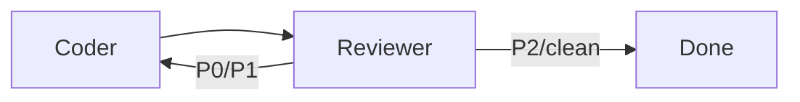
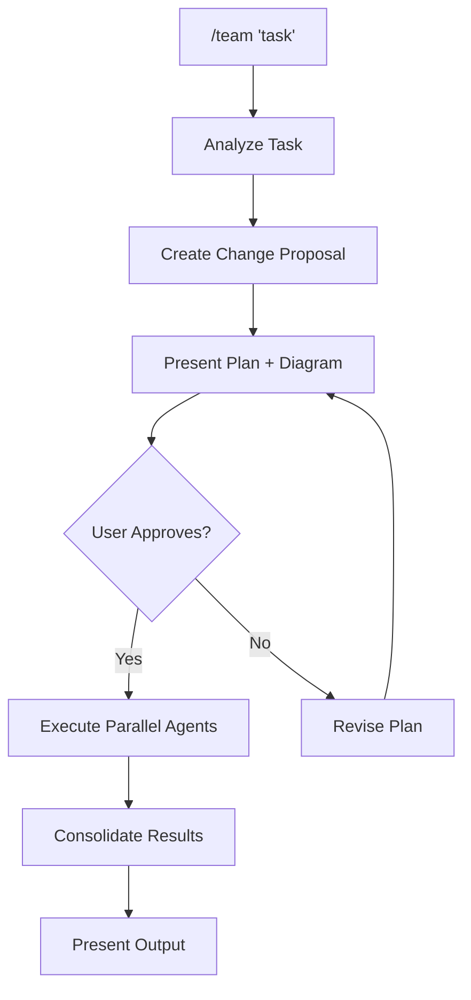
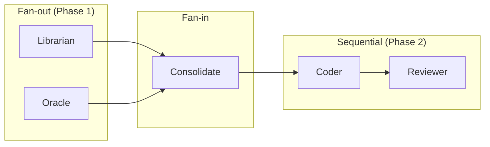

# Team Orchestration

Dispatch tasks to specialized agents running on optimal models. **Hybrid workflow**: plan first, get user approval, then execute **in parallel**.

## Quick Start

```
/team "Build a user authentication system with JWT"
```

This will:
1. Analyze the task and create a change proposal
2. Show you the plan with mermaid diagram
3. Wait for your approval
4. Execute with parallel agents

### Iterative Mode

For tasks requiring refinement until quality gates pass:

```
/team "Build auth system" --iterate
```

With iteration, the workflow becomes:
1. Plan → Approve → Execute (same as above)
2. **Reviewer outputs P0/P1** → Loop back to Coder with findings
3. Coder fixes issues → Reviewer reviews again
4. Repeat until **P2/clean** or max iterations (default: 3)



**Flags:**
| Flag | Default | Description |
|------|---------|-------------|
| `--iterate` | off | Enable Coder↔Reviewer loop |
| `--max-loops N` | 3 | Max refinement iterations |
| `--quality-bar` | P2 | Minimum quality to exit (P2 or clean) |

**For complex iterative workflows:** Use `/team-loop` or `/graph-loop` instead.

## Agent Roles & Models

| Role | Specialty | Primary Tool | Fallback |
|------|-----------|--------------|----------|
| **Oracle** | Architecture, design | Task tool (Opus) | - |
| **Librarian** | Research, exploration | Gemini CLI | Task tool (Explore) |
| **Coder** | Implementation | Task tool (Codex) | Codex CLI |
| **Reviewer** | Code review | Task tool (Codex) | Codex CLI |

### Routing Decisions

| Criteria | Gemini CLI | Task (Codex) | Task (Opus) |
|----------|------------|--------------|-------------|
| Strength | Breadth | Depth | Judgment |
| Context | 1M tokens | 400K tokens | 200K tokens |
| Best for | Explore, research | Implement, review | Design, decide |
| Reliability | ⚠️ Rate limits | ✅ Stable | ✅ Stable |

## Workflow: Plan -> Approve -> Execute



## Phase 1: Planning

When `/team` is invoked, create a change proposal:

```markdown
## Team Plan: [Task]

### Summary
[1-2 sentence description]

### Execution Flow
[Mermaid diagram]

### Agents to Deploy
| Phase | Agent | Tool | Task |
|-------|-------|------|------|
| 1 | Librarian | Gemini/Task | [specific task] |
| 1 | Oracle | Task (Opus) | [specific task] |
| 2 | Coder | Task (Codex) | [specific task] |
| 3 | Reviewer | Task (Codex) | [specific task] |

**Proceed with this plan?**
```

Use `AskUserQuestion` tool to get approval before executing.

## Phase 2: Execution

### Primary Method: Task Tool (Recommended)

**Use Task tool for reliability.** CLI tools can hit rate limits or have syntax changes.

```
# Parallel execution in SINGLE message with multiple tool calls:

Task tool #1 (Librarian):
  subagent_type: "gemini"  # or "Explore" as fallback
  run_in_background: true
  prompt: |
    Research the codebase for [topic].
    Find: [patterns, files, conventions]
    Report findings.

Task tool #2 (Oracle):
  subagent_type: "general-purpose"
  model: "opus"
  run_in_background: true
  prompt: |
    Design [feature] architecture.
    Consider: [requirements, constraints]
    Output: Architecture document with component breakdown.

Task tool #3 (Reviewer):
  subagent_type: "codex"
  prompt: |
    Review the following changes for:
    - Type safety
    - Edge cases
    - Test coverage
    - Security issues

    Files to review: [list files]
    Do NOT make changes, just review.
```

### Secondary Method: CLI Tools

Use CLI when Task tool is unavailable or for quick operations.

#### Gemini CLI (google-gemini/gemini-cli)

```bash
# Interactive mode (default)
gemini "Analyze the codebase structure"

# Non-interactive with prompt flag
gemini -p "
Analyze the codebase structure.
Find all API endpoints and their handlers.
Report patterns and conventions.
"

# With sandbox disabled (for file writes)
gemini -p "..." --yolo
```

**Gemini Rate Limits (Free Tier):**
- 60 requests/minute
- 1,000 requests/day
- 1M token context window (Gemini 2.5 Pro)

**Built-in Tools:** file operations, shell commands, web search, web fetch

**Gemini Limitations:**
- ⚠️ Rate limits (429 errors) - have fallback ready
- ⚠️ Cannot read files outside workspace (no /tmp access)
- ⚠️ Use inline prompts, NOT spec file paths

**Fallback when Gemini fails:**
```
Task tool:
  subagent_type: "Explore"
  prompt: [same prompt]
```

**Reference:** [Gemini CLI Documentation](https://geminicli.com/docs/)

#### Codex CLI (openai/codex)

```bash
# Interactive mode (default)
codex "Review these files for issues"

# Non-interactive with approval mode (for scripted/CI use)
codex -a never "
Review the changes in these files:
- service/pt_broker/config_loader.py
- main.py

Check for type safety, edge cases, test coverage.
Do NOT make changes.
"
```

**Approval Modes (`-a` flag):**
| Mode | Use Case |
|------|----------|
| `never` | Read-only tasks (review, analysis) - no approval prompts |
| `auto-edit` | Auto-approve file edits, prompt for commands |
| `full-auto` | Auto-approve everything (use with caution) |

**Sandbox Modes (`-s` flag):**
| Mode | Permission |
|------|------------|
| `read-only` | Browse files only |
| `write-cwd` | Edit in working directory |
| `write-root` | Full machine access |

```bash
# Combined flag examples
codex -a never -s read-only "Analyze code..."
codex -a auto-edit -s write-cwd "Fix the bug..."
```

**Codex Limitations:**
- ⚠️ Long startup time for large repos (context indexing)
- ✅ More reliable than Gemini for focused reviews
- ✅ Optimized for agentic coding tasks

**Prefer Task tool for Codex:**
```
Task tool:
  subagent_type: "codex"
  prompt: [same prompt]
```

**Reference:** [Codex CLI Documentation](https://openai.github.io/codex/)

### Parallel Execution Pattern

**CRITICAL: Launch independent agents in a SINGLE message**

```yaml
# CORRECT - Single message, parallel tool calls
# Call Task tool twice in same response:

# Agent 1 - Gemini for breadth
Task:
  description: "Research codebase patterns"
  subagent_type: gemini
  run_in_background: true
  prompt: "..."

# Agent 2 - Codex for depth (in SAME message)
Task:
  description: "Review code changes"
  subagent_type: codex
  run_in_background: true
  prompt: "..."
```

```yaml
# WRONG - Sequential execution (slow)
# Message 1: Task (gemini)
# Wait for result...
# Message 2: Task (codex)
```

### Error Handling

**When Gemini hits rate limits (429):**
```
1. Log the error
2. Fall back to Task tool with subagent_type: "Explore"
3. Continue with remaining agents
```

**When CLI syntax fails:**
```
1. Use Task tool instead of raw CLI
2. Task tool abstracts CLI differences
```

## Phase 3: Consolidation

After parallel agents complete:

```markdown
## Team Results: [Task]

### Execution Summary
| Agent | Status | Key Findings |
|-------|--------|--------------|
| Librarian | ✅ | [summary] |
| Oracle | ✅ | [summary] |
| Coder | ✅ | [summary] |
| Reviewer | ✅ | [summary] |

### Detailed Results

#### Librarian (Research)
[findings]

#### Oracle (Architecture)
[design decisions]

#### Coder (Implementation)
[changes made]

#### Reviewer (Review)
[issues found, recommendations]

### Next Steps
[action items]
```

## Memory & State Persistence

When using `--iterate` mode, team stores learnings across iterations:

```
.team/{task-name}/
├── state.json     # Execution state
├── memory.md      # Learnings across iterations
├── librarian.md   # Research findings
├── oracle.md      # Architecture decisions
└── iterations/    # Coder/Reviewer exchanges
```

### Memory Format

```markdown
# Memory: auth-feature

## Learnings
- JWT refresh tokens need 15min expiry (security)
- Use httpOnly cookies, not localStorage

## Decisions Made
- RS256 algorithm for JWT signing
- Separate refresh token endpoint

## Gotchas
- Tests require TEST_JWT_SECRET env var
```

Memory is automatically included in subsequent iterations to prevent repeating mistakes.

**Enable memory in single-shot mode:**

```
/team "Build feature" --persist-memory
```

This stores findings even without iteration, useful for multi-session work.

## Constraints

### MUST DO
- **PARALLELIZE** - Independent agents in same message
- Show mermaid diagram of execution plan
- Get user approval before spawning agents
- Have fallback when CLI tools fail
- Track progress with TodoWrite

### MUST NOT DO
- Run agents sequentially when they could be parallel
- Execute without user approval
- Use `/tmp` spec files with Gemini (can't access)
- Assume CLI syntax is stable (use Task tool)

## Lessons Learned

| Issue | Solution |
|-------|----------|
| Gemini 429 rate limits | Fall back to Task(Explore) |
| Gemini can't read /tmp | Use inline prompts |
| CLI syntax changes frequently | Prefer Task tool over raw CLI |
| Spec files unreliable | Inline prompts more robust |
| Reviewer findings unstructured | Use P0/P1/P2 severity format |
| Context lost between phases | Consolidate results before dependent phases |
| Single-shot limitations | Use `/team-loop` or `/graph-loop` for iteration |

## Best Practices (from Industry Patterns)

### Fan-out/Fan-in Pattern

This orchestration follows the **Fan-out/Fan-in cloud design pattern**:
- **Fan-out**: Launch multiple agents in parallel (single message, multiple Task calls)
- **Independent work**: Each agent operates independently, writes to unique output
- **Fan-in**: Consolidate all results before dependent phases



### When to Parallelize vs Sequence

| Parallelize When | Sequence When |
|------------------|---------------|
| Tasks are independent | Task B needs Task A's output |
| Different specializations | Building cumulative context |
| Time-sensitive scenarios | Deterministic order required |
| Multiple perspectives needed | Resource constraints exist |

### Structured Handoffs (Avoid Context Loss)

**Treat inter-agent transfer like a public API:**

1. **Oracle → Coder**: Output architecture as structured markdown with:
   - File structure
   - Pydantic model definitions
   - Integration points
   - Clear sections that Coder can reference

2. **Coder → Reviewer**: Specify files changed clearly

3. **Reviewer → User**: Use severity categories:
   - **P0**: Critical - blocks deployment
   - **P1**: Should fix before merge
   - **P2**: Nice to have
   - **OK**: No issues

### Agent Tool Selection Priority

```
1. Task tool (most reliable)
   ├── subagent_type: "Explore" - for research/breadth
   ├── subagent_type: "codex" - for implementation/review
   ├── subagent_type: "gemini" - for large context needs
   └── subagent_type: "general-purpose" + model: "opus" - for judgment

2. CLI tools (fallback only)
   ├── gemini -p "..." - rate limit prone
   └── codex -a never "..." - slow startup
```

### Prompt Engineering for Agents

**For Librarian (Research):**
```
ROLE: Librarian (Research)
PROJECT: [project name]
TASK: Research [topic]

FIND:
1. [specific item]
2. [specific item]

REPORT:
- File paths and line numbers
- Patterns discovered
- Conventions identified
```

**For Oracle (Architecture):**
```
ROLE: Oracle (Architect)
PROJECT: [project name]
TASK: Design [feature]

CONTEXT: [from Librarian findings]

DESIGN:
1. Pydantic models (with full code)
2. File structure
3. Integration points

OUTPUT: Architecture document that Coder can implement directly
```

**For Coder (Implementation):**
```
ROLE: Coder
PROJECT: [project name]
TASK: Implement [feature] based on architecture

ARCHITECTURE: [from Oracle output]

IMPLEMENT all items. Write production-ready code.
```

**For Reviewer (Code Review):**
```
ROLE: Reviewer
PROJECT: [project name]
TASK: Review implementation

FILES TO REVIEW: [list]

CHECK FOR:
1. Type safety
2. Thread safety (if applicable)
3. Error handling
4. Logging consistency
5. Test coverage gaps

OUTPUT: Review report with P0/P1/P2 categories
DO NOT make changes, just report findings.
```

## Example: Full Execution Flow

```
User: /team "Add scheduler observability"

Claude (Planning):
1. Creates plan with mermaid diagram
2. Shows agents: Librarian, Oracle (Phase 1), Coder (Phase 2), Reviewer (Phase 3)
3. Asks: "Proceed with this plan?"

User: "Yes"

Claude (Phase 1 - SINGLE message, parallel):
  Task #1: subagent_type="Explore", run_in_background=true
  Task #2: subagent_type="general-purpose", model="opus", run_in_background=true

Claude (Wait & Consolidate):
  TaskOutput #1, TaskOutput #2
  Summarize findings for user

Claude (Phase 2):
  Task: subagent_type="codex" (Coder implements based on Oracle's architecture)

Claude (Phase 3):
  Task: subagent_type="codex" (Reviewer audits with P0/P1/P2 format)

Claude (Present Results):
  | Agent | Status | Key Findings |
  |-------|--------|--------------|
  | Librarian | ✅ | [summary] |
  | Oracle | ✅ | [summary] |
  | Coder | ✅ | [summary] |
  | Reviewer | ✅ | [summary] |
```

## See Also

| Need | Skill |
|------|-------|
| Iterative refinement loops | `/graph-loop` - YAML-based workflow graphs |
| Team + iteration combined | `/team-loop` - Hybrid orchestration |
| Role template definitions | `/graph-loop/templates/team-roles.yaml` |
| Simple autonomous iteration | Ralph plugin (`/ralph-loop`) |

## Sources

Best practices informed by:
- [Azure AI Agent Design Patterns](https://learn.microsoft.com/en-us/azure/architecture/ai-ml/guide/ai-agent-design-patterns)
- [Google ADK Multi-Agent Patterns](https://developers.googleblog.com/developers-guide-to-multi-agent-patterns-in-adk/)
- [Skywork AI Agent Orchestration Best Practices](https://skywork.ai/blog/ai-agent-orchestration-best-practices-handoffs/)